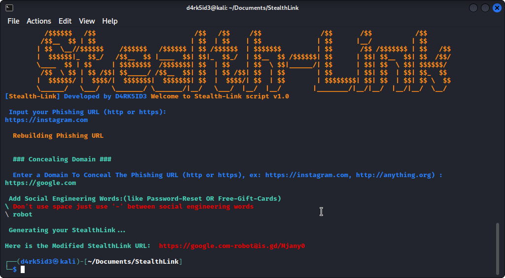

<!-- Author -->
<p align = "center">
     <h3 align = "center"> 👨‍💻️ Author : <a href = "https://github.com/d4rk5id3r"> d4rk5id3 </a> </h3>
</p>

<br/>

## 🔥 Stealth-Link
Stealth-link is not a tool for phishing. Instead, it serves as a demonstration of "URL Making Technology," achieved through a straightforward Bash Script and also available in python. Its purpose is to conceal a phishing URL beneath an innocent-looking URL such as wikipedia.com or facebook.com. It can be included in phishing tools, provided appropriate credit is given, to create a more credible URL appearance.

<br/>

## ⚖️ Ethical Notice
This program, Stealth-Link, is intended solely for educational purposes. It is illegal to use it to attack targets without obtaining prior mutual consent. The end user is responsible for complying with all relevant local, state, and federal laws. The developers are not liable for any misuse or damage resulting from the use of this program. Please use it responsibly.

<br/>

## 🛠️ Setup
```bash

# Clone the repository using the following command:
git clone https://github.com/d4rk5id3r/Stealth-Link

# Navigate to the directory using the following command:
cd StealthLink

# Grant Necessary Permissions 
chmod +x Stealthlink.sh

# Run the script using the following command:
bash Stealthlink.sh

```
```
python 

#Clone the repository using the following command:
git clone https://github.com/d4rk5id3r/Stealth-Link

# Navigate to the directory using the following command:
cd StealthLink

# Run the script using the following command:
python3 Stealthlink.py

```
<br/>

## Snapshots
<p align="">
	
</p>

<br />

## 
